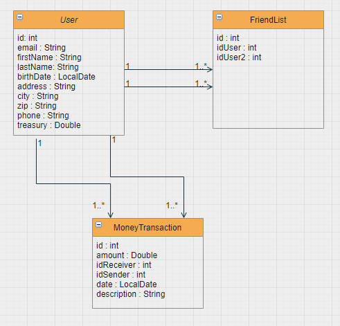

# PayMyBuddy

## Table of Content
* [Technical Informations](#1-technical-informations)
    * [Requirements](#11-requirements)
    * [Diagrams](#12-diagrams)
    * [Sql Scripts](#13-sql-scripts)
    * [Installation](#14-installation)
  
* [End Points](#2-endpoints)
    * [User](#21-user)
    * [Money Transaction](#22-money-transactions)
    * [FriendList](#23-friend-list)

* [Format](#3-format)
    * [User](#31-user-format)
    * [Money Transaction](#32-moneytransation-format)
    * [FriendList](#33-friendlist-format)
  
* [Points of attention](#4-points-of-attention)
  
    

## Description

DAL for PayMyBuddy, an app use for money transferts between friends
</br>
</br>

## 1. Technical informations

### 1.1 Requirements


</br>
</br>

### 1.2 Diagrams



</br>
</br>

### 1.3 SQL Scripts

In the SQL folder you have two script:

* sql_empty_init.sql containing and empty database
* pay_my_buddy.sql containing database with test ressources.
  </br>
  </br>

### 1.4 Installation
* Export project with:
```bash
mvn clean
mvn install
```
As Tomcat is embbeded, you can launch directly the *.jar with
```bash
java -jar {nameOfTheFile}.jar
```

## 2. Endpoints
### 2.1 User
```html
<!-- Return user for given id -->
GET -> /users/{id}
<!-- Return user for given email -->
GET -> /users?email=EMAIL
<!-- Post new user -->
POST -> /users
<!-- Delete user for given email -->
DELETE -> /users?email=EMAIL
<!-- Save an existing user -->
PUT -> /users
```
### 2.2 Money Transactions
```html
<!-- Post new Transaction -->
POST -> /moneyTransaction/
<!-- Get money transaction by its id -->
GET -> /moneyTransaction?id=ID
<!-- Use to withdraw money. No bank transactions implemented -->
PUT -> /moneyTransaction/withdraw
```

### 2.3 Friend List
```html
<!-- Post new friendship -->
POST -> /friends?userId=ID?userId2=ID2
<!-- Get a List with all Friends for given user id -->
GET -> /friends?userId=ID
<!-- Delete a friend relation between the given two user, only on userID side. -->
DELETE -> /friends?userId=ID?userId2=ID2
```

## 3 Format
### 3.1 User format
For creating new user, id is autogenerated and not required. But to modify ( put) a user, the id 
is required as it might create a new user instead.
```json
{
    "id":"",
    "firstName":"",
    "lastName":"",
    "email":"",
    "password":"",
    "address":"",
    "city":"",
    "zip":"",
    "phone":"",
    "birthDate":"",
    "treasury":""

      
}
```
### 3.2 MoneyTransation format
```json
{
    "amount":"",
    "idReceiver":"",
    "idSender":"",
    "date":"",
    "description":""      
}
```
### 3.3 FriendList format
On return a friendList, all information except firstName, lastName and email, are setted to null,
to avoid personnal information leak like adress and password.
```json
{
        "id": null,
        "firstName": "",
        "lastName": "",
        "email": "",
        "password": null,
        "address": null,
        "city": null,
        "zip": null,
        "phone": null,
        "birthDate": null,
        "treasury": null
    }
```

## 4 Points of attention
* When the billing service will be available, you can use the MoneyTransactionRepository 
  interface and call this method, to get all Transaction and bill them.
  ```Java
  List<MoneyTransaction> findAll();
  ```
  * I suggest to not go in production without the billing system done. It would be a pain and 
    source of potential issues to bill already done transactions (for example if user treasury 
    is 0, or account deleted after transaction).</br></br>
* To send money, frontend have to retrieved user friends to be able to make a transaction.</br></br>
* When a user is created there is no need to specify id, but when you want to modify a user, you 
  have to specify its id, or it may failed if its the same email, or create a new user if the 
  mail have change.</br></br>
    
* When a user is deleted, to preserve the MoneyTransaction relations, all field are set to 
  "Deleted" except the id which still exist. It avoid to delete all transactions, and make it 
  impossible to the "user 2", to get all the transactions in his history even if a user is not 
  member anymore. 
  It's the simpliest way i've found to respect RGPD.

